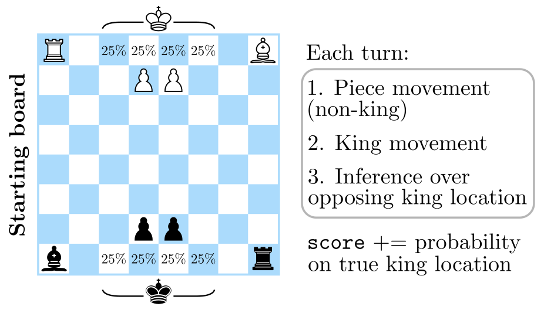
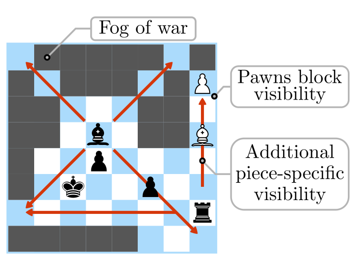

# InfoChess, a game of adversarial inference

**InfoChess is a minimal, fully controllable testbed for studying competitive information acquisition under partial observability.**

We introduce a symmetric, chess-like environment where **information, not material, is the sole objective**. 
Players operate under fog of war and are rewarded for accurately inferring the opponent king’s location, turning each move into an explicit tradeoff between information acquisition and concealment.
Useful for studying POMDP-style reasoning, belief modeling, and adversarial sensing.




The design intentionally strips away standard chess complexities to isolate information dynamics:
- No captures (no material advantage)
- Limited movement (one square per turn)
- Structured visibility: rooks/bishops cast rays through fog; pawns block them



After movement, players perform inference: score increases with the probability mass assigned to the true (oracle-evaluated) opponent king position. 
This yields a **fully quantifiable objective for information acquisition and concealment**.

---

Paper: [arXiv](arxiv.org) (to appear in the Adaptive and Learning Agents Workshop at AAMAS 2026)

If you use this code, please cite:
```bibtex
@inproceedings{murphy2026infochess,
  title={InfoChess: A Game of Adversarial Inference and a Laboratory for Quantifiable Information Control},
  author={Murphy, Kieran},
  journal={arXiv preprint arXiv:XXXX.XXXXX},
  year={2026}
}